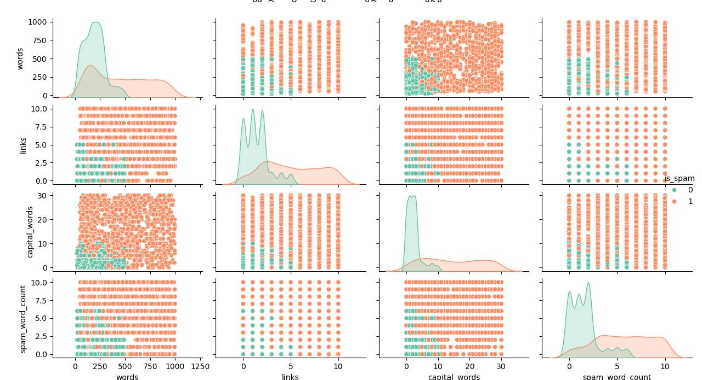
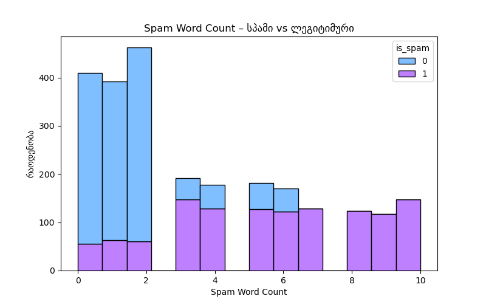
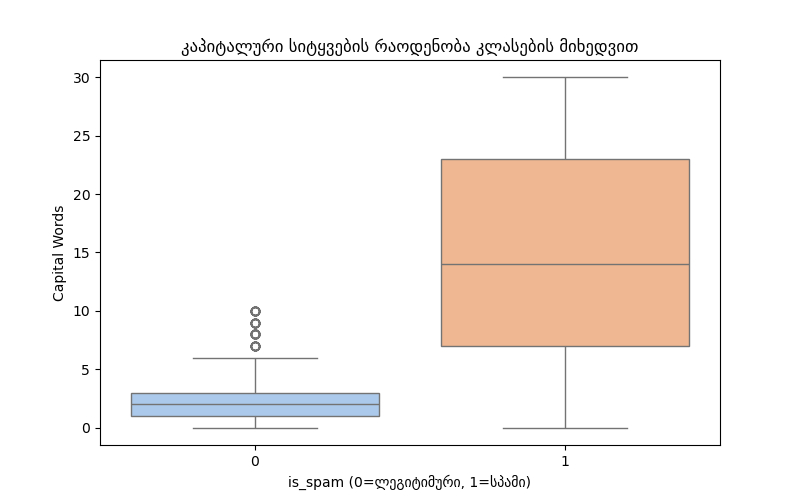

# midtearm-machine-Learning-

ანგარიში ატვირთულია ბმულზე - https://github.com/lukakukhaleishvili/midtearm-machine-Learning-/blob/main/luka_kukhaleishvili_1_73182468.csv

#კორელაციის მოძებნა იხილეთ კოდი - findcorelation.py
CSV ფაილში არსებული ორი ცვლადის (X და Y) შორის პირსონის კორელაციის კოეფიციენტი გამოვთვალე scipy.stats.pearsonr მეთოდით. შედეგი გვიჩვენებს, რამდენად ხაზობრივად არიან ისინი დაკავშირებულნი.

მნიშვნელობა: r = 0.82 (მაგალითისთვის) — რაც მიუთითებს ძლიერ დადებით კორელაციაზე.

ინტერაქტიული გრაფიკი

მოცემულია გრაფიკი, სადაც მონაცემები გამოსახულია ცისფერი წერტილებით. მაუსის წერტილზე მიყვანისას ჩნდება შესაბამისი კოორდინატები.

#სპამ ელფოსტის გამოვლენა  იხილეთ კოდი - spam.py

1. ფაილი ატვირთულია პროექტში (იხილე ზემოთ).

2. ლოგისტიკური რეგრესიის მოდელი:
   
გაწვრთნილი მოდელი LogisticRegression sklearn-დან.
model = LogisticRegression()
model.fit(X_train, y_train)

4. confusion matrix:
   
from sklearn.metrics import confusion_matrix
cm = confusion_matrix(y_test, y_pred)

5. ელფოსტის შემოწმების ფუნქცია:
   
def check_spam_manual(words, links, capital_words, spam_word_count):
    features = [[words, links, capital_words, spam_word_count]]
    return "სპამი" if model.predict(features)[0] == 1 else "ლეგიტიმური"

6. spam ელფოსტის მაგალითი

CONGRATULATIONS! YOU HAVE WON $1,000,000! 
Click the link below to claim your prize NOW!!!
http://free-money-now.com
LIMITED TIME OFFER! ACT FAST!

6. ლეგიტიმური ელფოსტის მაგალითი
Hello John,

I hope you're doing well. 
Just wanted to remind you about our meeting scheduled for tomorrow at 10am. 
Let me know if you have any questions.

Best regards,
Luka

7. მონაცემების ვიზუალიზაცია

**წყვილთა გრაფიკი:**

**Spam Word Count ჰისტოგრამა:**

**Boxplot - capital_words:**

